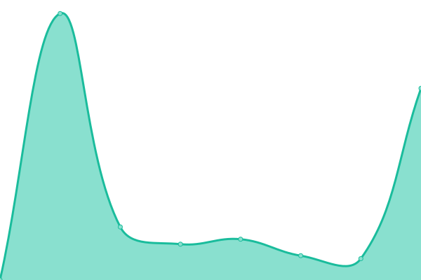
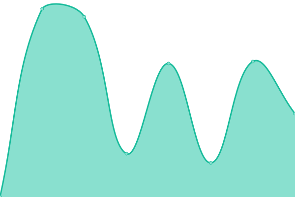
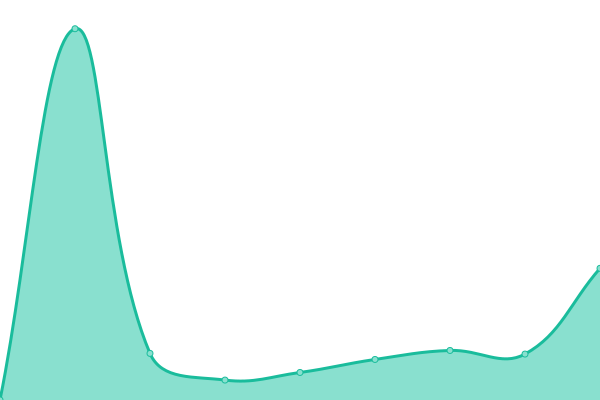
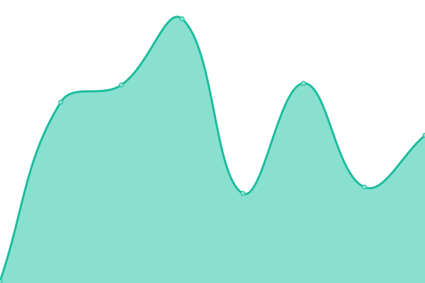

# [📈 Live Status](https://monitoring.tier1digital.com): <!--live status--> **🟧 Partial outage**

This repository contains the open-source uptime monitor and status page for [Michael Brant](http://michaelbrant.com), powered by [Upptime](https://github.com/upptime/upptime).

With [Upptime](https://upptime.js.org), you can get your own unlimited and free uptime monitor and status page, powered entirely by a GitHub repository. We use [Issues](https://github.com/mrbrant89/od1-monitoring/issues) as incident reports, [Actions](https://github.com/mrbrant89/od1-monitoring/actions) as uptime monitors, and [Pages](https://monitoring.tier1digital.com) for the status page.

<!--start: status pages-->
<!-- This summary is generated by Upptime (https://github.com/upptime/upptime) -->
<!-- Do not edit this manually, your changes will be overwritten -->
<!-- prettier-ignore -->
| URL | Status | History | Response Time | Uptime |
| --- | ------ | ------- | ------------- | ------ |
|  [Lyster Exteriors [855lysters.com]](https://855lysters.com) | 🟩 Up | [lyster-exteriors-855lysters-com.yml](https://github.com/mrbrant89/od1-monitoring/commits/HEAD/history/lyster-exteriors-855lysters-com.yml) | 

 3595ms
     
 | 

<a href="https://monitoring.tier1digital.com/history/lyster-exteriors-855lysters-com">99.90%</a>
    

|  [Smith & Valentine Law [yourvoiceintrial.com]](https://yourvoiceintrial.com) | 🟩 Up | [smith-and-valentine-law-yourvoiceintrial-com.yml](https://github.com/mrbrant89/od1-monitoring/commits/HEAD/history/smith-and-valentine-law-yourvoiceintrial-com.yml) | 

 2173ms
     
 | 

<a href="https://monitoring.tier1digital.com/history/smith-and-valentine-law-yourvoiceintrial-com">100.00%</a>
    

|  [Ackerman Insurance [ackerman-insurance.com]](https://ackerman-insurance.com) | 🟩 Up | [ackerman-insurance-ackerman-insurance-com.yml](https://github.com/mrbrant89/od1-monitoring/commits/HEAD/history/ackerman-insurance-ackerman-insurance-com.yml) | 

 644ms
     
 | 

<a href="https://monitoring.tier1digital.com/history/ackerman-insurance-ackerman-insurance-com">100.00%</a>
    

|  [Shine Smile [shinesmile.com]](https://shinesmile.com) | 🟥 Down | [shine-smile-shinesmile-com.yml](https://github.com/mrbrant89/od1-monitoring/commits/HEAD/history/shine-smile-shinesmile-com.yml) | 

 0ms
     
 | 

<a href="https://monitoring.tier1digital.com/history/shine-smile-shinesmile-com">0.00%</a>
    

|  [Spa (Shine Smile) [spa.shinesmile.com]](https://spa.shinesmile.com) | 🟥 Down | [spa-shine-smile-spa-shinesmile-com.yml](https://github.com/mrbrant89/od1-monitoring/commits/HEAD/history/spa-shine-smile-spa-shinesmile-com.yml) | 

 0ms
     
 | 

<a href="https://monitoring.tier1digital.com/history/spa-shine-smile-spa-shinesmile-com">0.00%</a>
    

|  [No Limit Contracting & Design [nolimitcontractinganddesign.com]](https://nolimitcontractinganddesign.com) | 🟩 Up | [no-limit-contracting-and-design-nolimitcontractinganddesign-com.yml](https://github.com/mrbrant89/od1-monitoring/commits/HEAD/history/no-limit-contracting-and-design-nolimitcontractinganddesign-com.yml) | 

 1914ms
     
 | 

<a href="https://monitoring.tier1digital.com/history/no-limit-contracting-and-design-nolimitcontractinganddesign-com">100.00%</a>
    

|  [Dependable LP Gas [dependablelpgas.com]](https://www.dependablelpgas.com) | 🟩 Up | [dependable-lp-gas-dependablelpgas-com.yml](https://github.com/mrbrant89/od1-monitoring/commits/HEAD/history/dependable-lp-gas-dependablelpgas-com.yml) | 

 999ms
     
 | 

<a href="https://monitoring.tier1digital.com/history/dependable-lp-gas-dependablelpgas-com">100.00%</a>
    

|  [Auto Lock Specialists LLC [grandrapids-locksmith.com]](https://grandrapids-locksmith.com) | 🟩 Up | [auto-lock-specialists-llc-grandrapids-locksmith-com.yml](https://github.com/mrbrant89/od1-monitoring/commits/HEAD/history/auto-lock-specialists-llc-grandrapids-locksmith-com.yml) | 

 1327ms
     
 | 

<a href="https://monitoring.tier1digital.com/history/auto-lock-specialists-llc-grandrapids-locksmith-com">100.00%</a>
    

|  [Paul Blank Dental [paulblank.dental]](https://paulblank.dental) | 🟩 Up | [paul-blank-dental-paulblank-dental.yml](https://github.com/mrbrant89/od1-monitoring/commits/HEAD/history/paul-blank-dental-paulblank-dental.yml) | 

 1473ms
     
 | 

<a href="https://monitoring.tier1digital.com/history/paul-blank-dental-paulblank-dental">100.00%</a>
    

|  [Auto Lock Specialists [kalamazoo-locksmith.com]](https://kalamazoo-locksmith.com) | 🟩 Up | [auto-lock-specialists-kalamazoo-locksmith-com.yml](https://github.com/mrbrant89/od1-monitoring/commits/HEAD/history/auto-lock-specialists-kalamazoo-locksmith-com.yml) | 

 1844ms
     
 | 

<a href="https://monitoring.tier1digital.com/history/auto-lock-specialists-kalamazoo-locksmith-com">100.00%</a>
    

|  [Jot & Tittle Concrete [jotandtittleconcrete.com]](https://jotandtittleconcrete.com) | 🟩 Up | [jot-and-tittle-concrete-jotandtittleconcrete-com.yml](https://github.com/mrbrant89/od1-monitoring/commits/HEAD/history/jot-and-tittle-concrete-jotandtittleconcrete-com.yml) | 

 1027ms
     
 | 

<a href="https://monitoring.tier1digital.com/history/jot-and-tittle-concrete-jotandtittleconcrete-com">100.00%</a>
    

|  [Ravens Remodeling [ravenremodelingoflansing.com]](https://ravenremodelingoflansing.com) | 🟩 Up | [ravens-remodeling-ravenremodelingoflansing-com.yml](https://github.com/mrbrant89/od1-monitoring/commits/HEAD/history/ravens-remodeling-ravenremodelingoflansing-com.yml) | 

 1503ms
     
 | 

<a href="https://monitoring.tier1digital.com/history/ravens-remodeling-ravenremodelingoflansing-com">100.00%</a>
    

|  [Tier 1 Digital [tier1digital.com]](https://tier1digital.com) | 🟩 Up | [tier-1-digital-tier1digital-com.yml](https://github.com/mrbrant89/od1-monitoring/commits/HEAD/history/tier-1-digital-tier1digital-com.yml) | 

 446ms
     
 | 

<a href="https://monitoring.tier1digital.com/history/tier-1-digital-tier1digital-com">100.00%</a>
    

|  [A Bail Co [abailco.com]](https://abailco.com) | 🟩 Up | [a-bail-co-abailco-com.yml](https://github.com/mrbrant89/od1-monitoring/commits/HEAD/history/a-bail-co-abailco-com.yml) | 

 1358ms
     
 | 

<a href="https://monitoring.tier1digital.com/history/a-bail-co-abailco-com">100.00%</a>
    

|  [Carlson Gracie Grand Rapids [carlsongraciegrandrapids.com]](https://carlsongraciegrandrapids.com) | 🟩 Up | [carlson-gracie-grand-rapids-carlsongraciegrandrapids-com.yml](https://github.com/mrbrant89/od1-monitoring/commits/HEAD/history/carlson-gracie-grand-rapids-carlsongraciegrandrapids-com.yml) | 

 1650ms
     
 | 

<a href="https://monitoring.tier1digital.com/history/carlson-gracie-grand-rapids-carlsongraciegrandrapids-com">100.00%</a>
    

|  [Arctic Training Center [atcbjj.fitness]](https://atcbjj.fitness) | 🟩 Up | [arctic-training-center-atcbjj-fitness.yml](https://github.com/mrbrant89/od1-monitoring/commits/HEAD/history/arctic-training-center-atcbjj-fitness.yml) | 

 2468ms
     
 | 

<a href="https://monitoring.tier1digital.com/history/arctic-training-center-atcbjj-fitness">100.00%</a>
    

|  [2 The Rescue [2therescuellc.com]](https://2therescuellc.com) | 🟥 Down | [2-the-rescue-2therescuellc-com.yml](https://github.com/mrbrant89/od1-monitoring/commits/HEAD/history/2-the-rescue-2therescuellc-com.yml) | 

 0ms
     
 | 

<a href="https://monitoring.tier1digital.com/history/2-the-rescue-2therescuellc-com">0.00%</a>
    

|  [Brendan Burch [brendanburch9.com]](https://brendanburch9.com) | 🟩 Up | [brendan-burch-brendanburch9-com.yml](https://github.com/mrbrant89/od1-monitoring/commits/HEAD/history/brendan-burch-brendanburch9-com.yml) | 

 805ms
     
 | 

<a href="https://monitoring.tier1digital.com/history/brendan-burch-brendanburch9-com">100.00%</a>
    

|  [Kzoo BJJ [kzoobjj.net]](https://kzoobjj.net) | 🟩 Up | [kzoo-bjj-kzoobjj-net.yml](https://github.com/mrbrant89/od1-monitoring/commits/HEAD/history/kzoo-bjj-kzoobjj-net.yml) | 

 1351ms
     
 | 

<a href="https://monitoring.tier1digital.com/history/kzoo-bjj-kzoobjj-net">100.00%</a>
    

<!--end: status pages-->

[**Visit our status website →**](https://monitoring.tier1digital.com)

## 📄 License

- Powered by: [Upptime](https://github.com/upptime/upptime)
- Code: [MIT](./LICENSE) © [Michael Brant](http://michaelbrant.com)
- Data in the `./history` directory: [Open Database License](https://opendatacommons.org/licenses/odbl/1-0/)
