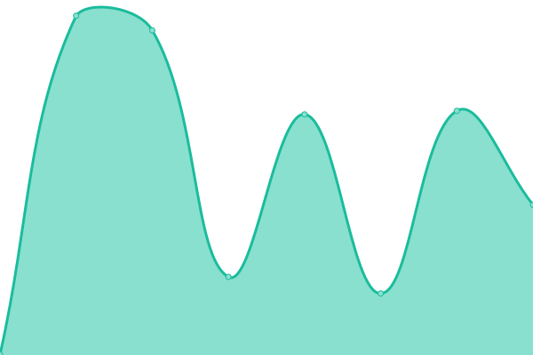
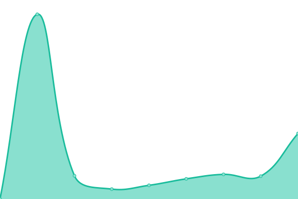

# [📈 Live Status](https://monitoring.tier1digital.com): <!--live status--> **🟧 Partial outage**

This repository contains the open-source uptime monitor and status page for [Michael Brant](http://michaelbrant.com), powered by [Upptime](https://github.com/upptime/upptime).

With [Upptime](https://upptime.js.org), you can get your own unlimited and free uptime monitor and status page, powered entirely by a GitHub repository. We use [Issues](https://github.com/mrbrant89/od1-monitoring/issues) as incident reports, [Actions](https://github.com/mrbrant89/od1-monitoring/actions) as uptime monitors, and [Pages](https://monitoring.tier1digital.com) for the status page.

<!--start: status pages-->
<!-- This summary is generated by Upptime (https://github.com/upptime/upptime) -->
<!-- Do not edit this manually, your changes will be overwritten -->
<!-- prettier-ignore -->
| URL | Status | History | Response Time | Uptime |
| --- | ------ | ------- | ------------- | ------ |
|  [Lyster Exteriors [855lysters.com]](https://855lysters.com) | 🟩 Up | [lyster-exteriors-855lysters-com.yml](https://github.com/mrbrant89/od1-monitoring/commits/HEAD/history/lyster-exteriors-855lysters-com.yml) | 

 1103ms
     
 | 

<a href="https://monitoring.tier1digital.com/history/lyster-exteriors-855lysters-com">100.00%</a>
    

|  [Smith & Valentine Law [yourvoiceintrial.com]](https://yourvoiceintrial.com) | 🟩 Up | [smith-and-valentine-law-yourvoiceintrial-com.yml](https://github.com/mrbrant89/od1-monitoring/commits/HEAD/history/smith-and-valentine-law-yourvoiceintrial-com.yml) | 

 900ms
     
 | 

<a href="https://monitoring.tier1digital.com/history/smith-and-valentine-law-yourvoiceintrial-com">100.00%</a>
    

|  [Ackerman Insurance [ackerman-insurance.com]](https://ackerman-insurance.com) | 🟩 Up | [ackerman-insurance-ackerman-insurance-com.yml](https://github.com/mrbrant89/od1-monitoring/commits/HEAD/history/ackerman-insurance-ackerman-insurance-com.yml) | 

 589ms
     
 | 

<a href="https://monitoring.tier1digital.com/history/ackerman-insurance-ackerman-insurance-com">100.00%</a>
    

|  [Dependable LP Gas [dependablelpgas.com]](https://www.dependablelpgas.com) | 🟩 Up | [dependable-lp-gas-dependablelpgas-com.yml](https://github.com/mrbrant89/od1-monitoring/commits/HEAD/history/dependable-lp-gas-dependablelpgas-com.yml) | 

 2338ms
     
 | 

<a href="https://monitoring.tier1digital.com/history/dependable-lp-gas-dependablelpgas-com">100.00%</a>
    

|  [Jot & Tittle Concrete [jotandtittleconcrete.com]](https://jotandtittleconcrete.com) | 🟩 Up | [jot-and-tittle-concrete-jotandtittleconcrete-com.yml](https://github.com/mrbrant89/od1-monitoring/commits/HEAD/history/jot-and-tittle-concrete-jotandtittleconcrete-com.yml) | 

 2044ms
     
 | 

<a href="https://monitoring.tier1digital.com/history/jot-and-tittle-concrete-jotandtittleconcrete-com">100.00%</a>
    

|  [Ravens Remodeling [ravenremodelingoflansing.com]](https://ravenremodelingoflansing.com) | 🟩 Up | [ravens-remodeling-ravenremodelingoflansing-com.yml](https://github.com/mrbrant89/od1-monitoring/commits/HEAD/history/ravens-remodeling-ravenremodelingoflansing-com.yml) | 

 2160ms
     
 | 

<a href="https://monitoring.tier1digital.com/history/ravens-remodeling-ravenremodelingoflansing-com">100.00%</a>
    

|  [Tier 1 Digital [tier1digital.com]](https://tier1digital.com) | 🟥 Down | [tier-1-digital-tier1digital-com.yml](https://github.com/mrbrant89/od1-monitoring/commits/HEAD/history/tier-1-digital-tier1digital-com.yml) | 

 136ms
     
 | 

<a href="https://monitoring.tier1digital.com/history/tier-1-digital-tier1digital-com">0.00%</a>
    

|  [Carlson Gracie Grand Rapids [carlsongraciegrandrapids.com]](https://carlsongraciegrandrapids.com) | 🟩 Up | [carlson-gracie-grand-rapids-carlsongraciegrandrapids-com.yml](https://github.com/mrbrant89/od1-monitoring/commits/HEAD/history/carlson-gracie-grand-rapids-carlsongraciegrandrapids-com.yml) | 

 838ms
     
 | 

<a href="https://monitoring.tier1digital.com/history/carlson-gracie-grand-rapids-carlsongraciegrandrapids-com">100.00%</a>
    

|  [Arctic Training Center [atcbjj.fitness]](https://atcbjj.fitness) | 🟩 Up | [arctic-training-center-atcbjj-fitness.yml](https://github.com/mrbrant89/od1-monitoring/commits/HEAD/history/arctic-training-center-atcbjj-fitness.yml) | 

 1493ms
     
 | 

<a href="https://monitoring.tier1digital.com/history/arctic-training-center-atcbjj-fitness">100.00%</a>
    

|  [Michigan Solar Pros [misolarpros.com]](https://misolarpros.com) | 🟩 Up | [michigan-solar-pros-misolarpros-com.yml](https://github.com/mrbrant89/od1-monitoring/commits/HEAD/history/michigan-solar-pros-misolarpros-com.yml) | 

 985ms
     
 | 

<a href="https://monitoring.tier1digital.com/history/michigan-solar-pros-misolarpros-com">100.00%</a>
    

<!--end: status pages-->

[**Visit our status website →**](https://monitoring.tier1digital.com)

## 📄 License

- Powered by: [Upptime](https://github.com/upptime/upptime)
- Code: [MIT](./LICENSE) © [Michael Brant](http://michaelbrant.com)
- Data in the `./history` directory: [Open Database License](https://opendatacommons.org/licenses/odbl/1-0/)
